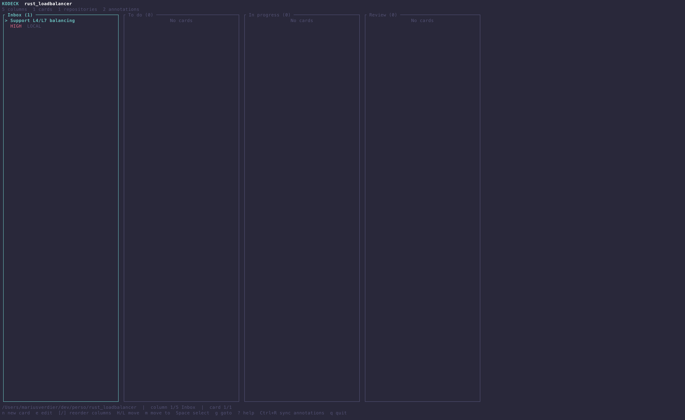
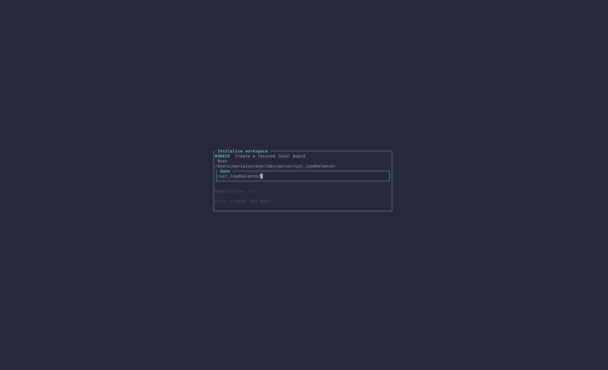
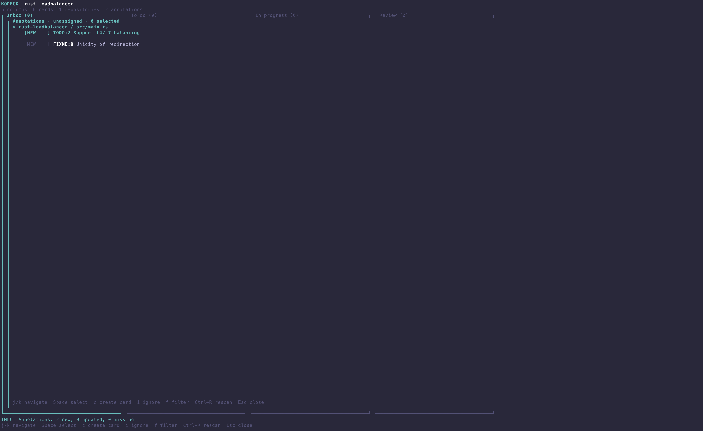
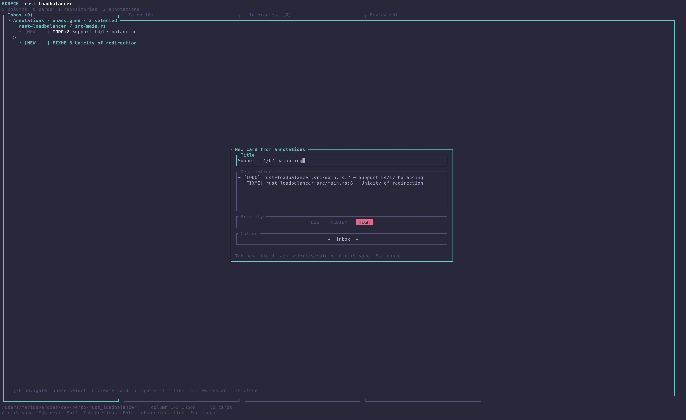
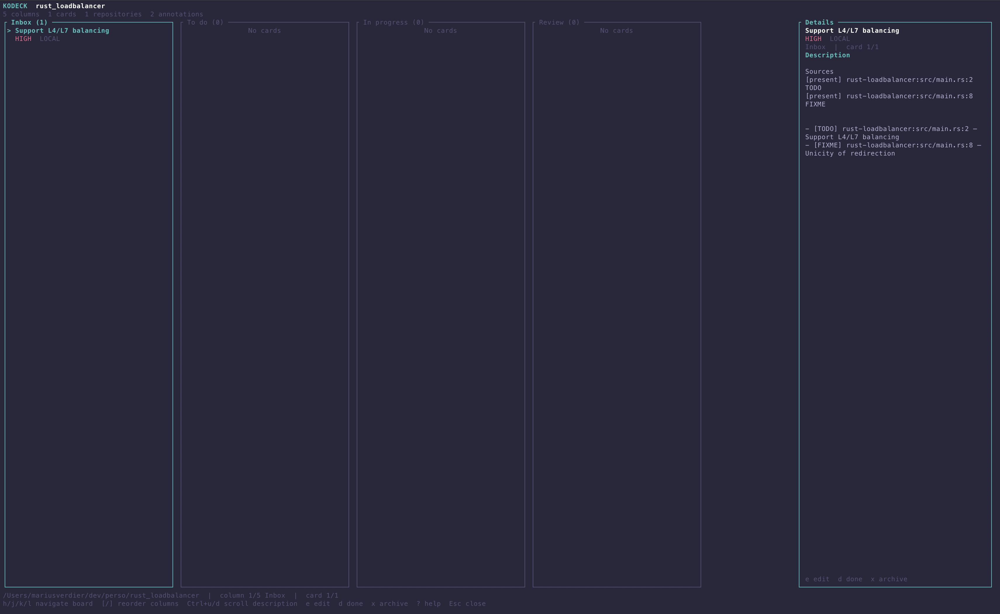

# Kodeck

Kodeck is a local-first Kanban board for the terminal. It keeps project work close
to the code and turns `TODO`, `FIXME`, `BUG`, or any custom annotation into
actionable cards.

<p align="center">
  
</p>

## Why Kodeck?

- **Stay in the terminal.** Navigate and manage the board without leaving your
  keyboard.
- **Work across repositories.** One workspace can scan one or several codebases.
- **Turn code annotations into cards.** Review discoveries, group related sources,
  and create a single editable card.
- **Keep private work private.** The workspace definition can be committed while
  cards and UI state remain outside the repository.
- **Resync safely.** Source changes are reconciled without replacing card titles,
  descriptions, priorities, or columns you edited.

Kodeck is currently at version `0.1.0` and is installed from source.

## Installation

Kodeck requires a recent stable [Rust toolchain](https://www.rust-lang.org/tools/install).

```sh
git clone https://github.com/marius-verdier/kodeck.git
cd kodeck
cargo install --path .
```

Then start Kodeck from the repository—or the parent directory containing the
repositories—you want to manage:

```sh
cd /path/to/your/project
kodeck
```

On first launch, Kodeck proposes the current Git root and detects the repositories
inside it. Choose a name and press `Enter` to create the workspace.

<p align="center">
  
</p>

## Workspaces

Kodeck discovers a workspace by looking for `.kodeck/workspace.json` in the
current directory and its parents. Starting it from a different uninitialized Git
repository proposes creating a workspace there; it does not silently open an
unrelated workspace.

The data is split deliberately:

| Data | Default location | Shared? |
| --- | --- | --- |
| Workspace definition | `<workspace>/.kodeck/workspace.json` | Yes, safe to commit |
| Cards and annotations | `~/.local/share/kodeck/workspaces/<workspace-id>/cards.json` | No |
| UI state | `~/.local/share/kodeck/workspaces/<workspace-id>/state.json` | No |
| Workspace registry | `~/.config/kodeck/config.json` | No |

`XDG_DATA_HOME` and `XDG_CONFIG_HOME` override the two home-directory defaults.
Secrets do not belong in `workspace.json`; unknown fields, including embedded
tokens, are rejected.

### Configuring `workspace.json`

The generated configuration can be edited to add repositories, reorder or rename
columns, and map annotations to card defaults:

```json
{
  "schema_version": 1,
  "id": "f94d2d12-5acf-4370-bb04-41ec860bb205",
  "name": "Project Workspace",
  "repositories": [
    {
      "id": "frontend",
      "path": "./apps/frontend"
    },
    {
      "id": "api",
      "path": "./services/api"
    }
  ],
  "columns": [
    {
      "id": "inbox",
      "name": "Inbox"
    },
    {
      "id": "todo",
      "name": "To do"
    },
    {
      "id": "in-progress",
      "name": "In progress"
    },
    {
      "id": "review",
      "name": "Review"
    },
    {
      "id": "done",
      "name": "Done"
    }
  ],
  "providers": [],
  "status_mappings": [],
  "annotation_tags": [
    {
      "tag": "TODO",
      "column_id": "inbox",
      "priority": "low"
    },
    {
      "tag": "FIXME",
      "column_id": "inbox",
      "priority": "high"
    },
    {
      "tag": "BUG",
      "column_id": "inbox",
      "priority": "high"
    }
  ]
}
```

Configuration rules:

- Repository paths are relative to the workspace root. Use `"."` when the
  workspace root is itself the repository.
- Repository and column IDs, as well as annotation tags, must be unique. Tags are
  compared without regard to case.
- A tag may contain ASCII letters, digits, `_`, and `-`.
- Each annotation `column_id` must reference an existing column.
- Priorities are `low`, `medium`, or `high`.
- If `annotation_tags` is omitted, Kodeck uses the `TODO`, `FIXME`, and `BUG`
  mappings shown above.
- Set `"annotation_tags": []` to disable annotation discovery.
- Restart Kodeck after editing the file; configuration is loaded when the
  workspace opens.

Keep the generated workspace UUID stable. It connects the shared definition to
the private cards stored on the current machine.

## Annotation sync

Kodeck recognizes configured tags case-insensitively when they are followed by a
message:

```rust
// TODO: support keyboard-driven filtering
// FIXME handle an ambiguous redirect
// BUG: preserve the selected card after a refresh
```

The sync runs asynchronously every time the workspace opens. Press `Ctrl+R` from
the board or annotation review to run it manually. A plain `s` is intentionally
unbound, so a sync is harder to trigger by accident.

Configured and available repositories are scanned in parallel. Kodeck respects
Git ignore rules and skips `.git`, `.kodeck`, `target`, and `node_modules`.

### Review discoveries

New annotations open the review automatically after the opening sync. A manual
sync always opens it, even when nothing new was found.

<p align="center">
  
</p>

The review groups findings by repository and file and marks them as `NEW`,
`LINKED`, `IGNORED`, or `MISSING`. Use `f` to cycle through unassigned, all,
missing, and ignored annotations.

Select one or several annotations with `Space`, then press `c`. Kodeck creates one
card form with:

- the first annotation message as its title;
- every selected source in its description;
- the highest mapped priority among the selected tags;
- the column associated with that highest-priority mapping.

All these values remain editable before saving.

<p align="center">
  
</p>

Press `i` instead when an annotation should be ignored. Ignored annotations remain
in the catalog and can be inspected with the ignored filter.

### Source tracking

Linked sources appear in the card detail view with their repository, file, line,
tag, and current presence.

<p align="center">
  
</p>

On later syncs, Kodeck updates source locations while preserving edits made to the
card itself. If all linked sources disappear, the card is archived automatically.
It is restored when a source returns only when the sync originally archived it;
a manually archived card stays archived.

## Keymap

Press `?` from the board or card details to open the in-app shortcut reference.
Arrow keys are available alongside the Vim-style navigation keys.

### Board

| Keys | Action |
| --- | --- |
| `h` / `l`, `←` / `→`, `Tab` / `Shift+Tab` | Move between columns |
| `j` / `k`, `↓` / `↑` | Move between cards |
| `n` | Create a card |
| `N` | Create a column |
| `e` | Edit the focused card |
| `Enter` | Open card details |
| `d` | Move selected or focused cards to Done |
| `x` | Archive selected or focused cards |
| `X` | Delete the focused empty column |
| `H` / `L` | Move selected or focused cards left or right |
| `[` / `]` | Reorder the focused column |
| `m` | Move selected or focused cards to a chosen column |
| `Space` | Toggle card selection |
| `g` | Start a goto command |
| `Ctrl+R` | Sync code annotations |
| `?` | Open keyboard help |
| `Esc` | Close or clear the active board state |
| `q` | Quit |

### Goto commands

| Keys | Action |
| --- | --- |
| `gg` | First card |
| `ge` | Last card |
| `gh` | First column |
| `gl` | Last column |
| `gw` | Show two-letter labels for visible cards |
| `Esc` | Cancel |

### Card details

| Keys | Action |
| --- | --- |
| `h` / `j` / `k` / `l`, arrow keys | Navigate the board while details stay open |
| `Ctrl+U` / `Ctrl+D` | Scroll the description |
| `[` / `]` | Reorder the focused column |
| `e` | Edit |
| `d` | Move to Done |
| `x` | Archive |
| `?` | Open keyboard help |
| `Esc` | Close details |

### Forms

| Keys | Action |
| --- | --- |
| `Tab` / `Shift+Tab` | Move between fields |
| `←` / `→` | Change the focused priority or column |
| `Enter` | Advance from the title or insert a description line |
| `Ctrl+S` | Save |
| `Esc` | Discard changes |

### Annotation review

| Keys | Action |
| --- | --- |
| `j` / `k`, `↓` / `↑` | Navigate annotations |
| `Space` | Toggle selection |
| `c` | Create one card from the selection or focused annotation |
| `i` | Ignore the selection or focused annotation |
| `f` | Cycle filters |
| `Ctrl+R` | Rescan annotations |
| `Esc` | Close the review |

### Pickers and confirmations

| Keys | Action |
| --- | --- |
| `j` / `k`, `↓` / `↑` | Navigate a move picker |
| `Enter` | Confirm the selected destination |
| `y` / `n` | Accept or reject a confirmation |
| `h` / `l`, arrow keys, `Tab` | Change the selected confirmation choice |
| `Esc` | Cancel |

## Roadmap / TODO

- [ ] Sync cards with Trello, GitLab Issues, and GitHub Issues.
- [ ] Add Git-aware workflows using the current branch, working-tree status, and
  ahead/behind state to adapt the board context.
- [ ] Open a linked annotation directly in the configured editor.
- [ ] Add a watch mode that automatically rescans annotations as source files
  change.

## Development

```sh
cargo fmt --all -- --check
cargo test --all-targets
cargo clippy --all-targets -- -D warnings
```
